class: center, middle

background-image: url("capa1.png")
background-position: center
background-size: contain

```{r setup, include=FALSE}
options(htmltools.dir.version = FALSE)
knitr::opts_chunk$set(message = FALSE, warning = FALSE,
                      fig.align = "center")
```

<style type="text/css">
.remark-slide-content, .remark-code {
    font-size: 20px;
    padding: 1em 1em 1em 1em;
}

.small-code .remark-code {
    font-size: 20px;
    padding: 1em 1em 1em 1em;
}
a{ font-size:80%;}
.math {font-size: big;}

.large { font-size: 200% }

</style>

#A importância da técnica na análise de dados

###Profa. Dra. Luciane Alcoforado

###Universidade Federal Fluminense

---


class: center, middle, inverse


#A importância da técnica...

##R
---
class: center, middle
background-image: url("img/capa1.png")
background-position: center
background-size: contain

# Universidade Federal Fluminense

### Departamento de Estatística 

### Programa de Pós-Graduação em Engenharia Civil

---
class: inverse, center, middle

#  Grupo de Pesquisa Estatística é com R!

###Extensão junto à comunidade

(http://www.estatisticacomr.uff.br)

(http://www.youtube.com/estatisticacomr)

(http://www.ser.uff.br)

(http://www.meetup.com/pt-BR/rladies-niteroi)

(https://dataunirio.github.io)


---
class: inverse, middle
# A linguagem R

**R** foi criada por *R*oss Ihaka e *R*obert Gentleman e sua primeira versão oficial foi publicada em fevereiro de 2000.

**quinta posição** entre as mais populares no ano 2016 (IEEE Spectrum)

**Especializada em cálculos estatísticos e gráficos**

**Ferramenta essencial para a análise de dados**

**>15 mil pacotes**


---
class: inverse, middle

#Rstudio

-Fundado em 2009 por J.J. Allaire

-Um ambiente de desenvolvimento integrado para a linguagem R

-Um dos maiores contribuidores para o desenvolvimento e manutenção da linguagem R no mundo

-formado por jovens cientistas que produzem diversos pacotes facilitadores e integradores de análise de dados


---
background-image: url(http://www.estatisticacomr.uff.br/wp-content/uploads/2016/09/cropped-cropped-baner_tv_estatisticacomr.jpg)
background-position: 50% 50%
class: center, bottom, inverse

# Acesse nosso portal!
(www.estatisticacomr.uff.br)

---
# Blog

A página inicial funciona como um blog onde postamos pequenos textos sobre a linguagem R

O post mais acessado no último ano (http://www.estatisticacomr.uff.br/?p=176)


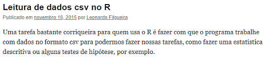

```{r eval=FALSE, include=T}
#Comando para leitura
```

read.csv2("http://www.estatisticacomr.uff.br/wp-content/uploads/2015/07/acidentes.csv")


---
class: center, middle, inverse

# Leitura de dados

Tarefa fundamental para o analista

-Arquivos csv

-Banco de dados: integração com o R (https://dataunirio.github.io/Curso_R_e_postgreSQL/index.html#1)


---

# Operadores lógicos


Há muito interesse nesse post 

 (http://www.estatisticacomr.uff.br/?p=209)

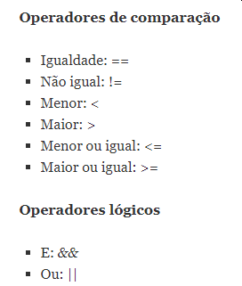
## Onde aplicamos? Em consultas à base de dados
---
#Pacotes do R para que servem?

-Facilitam nossas vidas

-Especialidade em determinadas tarefas

##Exemplo: Pacote dplyr

Seleciona colunas (select), filtra linhas (filter), resume as variáveis (summarise), etc

##Vídeo aulas do canal youtube:

https://www.youtube.com/playlist?list=PL98wo5oPtTvK13bqouN2vRZdwcSAEf_jS

-Introdução ao Tidyverse (pacote)

---
class: center, middle, inverse
#O canal de vídeos do youtube

###Objetivo: fornecer material de apoio para iniciantes na linguagem R

###Proposta: vídeos curtos de no máximo 3 minutos

Início da produção: 2015

Vídeos mais acessados no último ano:

-Como instalar o R e o Rstudio (https://www.youtube.com/watch?v=8LnZNC4hxdQ&list=PL98wo5oPtTvK05exP_8Bku3ye-xXIlRc9&index=3&t=0s)

-Leitura de dados csv (https://www.youtube.com/watch?v=Xdtq82tMLqI&list=PL98wo5oPtTvK05exP_8Bku3ye-xXIlRc9&index=4)

---
class: center, middle, inverse
#Seu apoio ao canal é muito importante

###<font color="white" face="Arial Narrow">> 950 inscritos, 30 mil visualizações e 30 vídeos publicados</font>

Não temos propagandas vinculadas ao canal

(https://www.youtube.com/estatisticacomr)


```{r echo=FALSE, out.width="100%"}
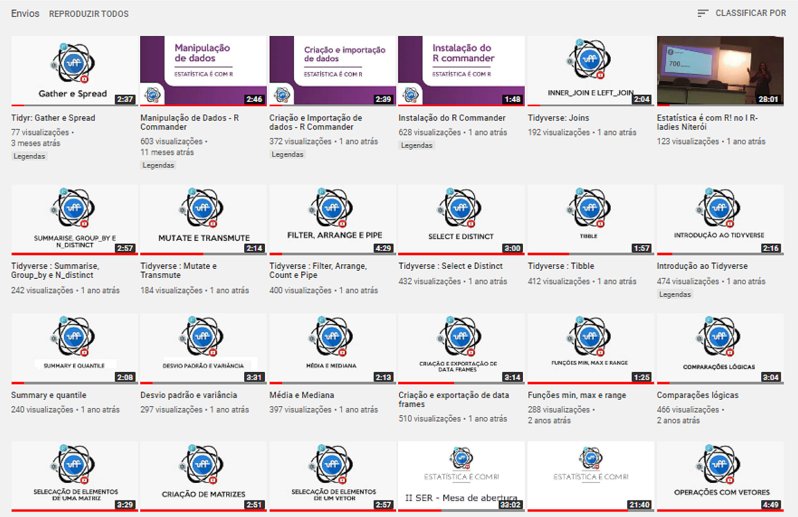
```
---
#Explorando visualmente a base de dados

##Pacote ggplot2

Extremamente útil para explorar relação entre variáveis

link oficial: (https://ggplot2.tidyverse.org/)

ebook gratuito sobre visualização de dados (http://www.estatisticacomr.uff.br/?page_id=21)

<style>
figure:hover{
    -webkit-transform:rotate(-5deg);
}
figure{
    background-color: white;
    width: 180px;
    text-align: center;
    padding: 15px;
    font-family: 'Comic Sans MS', cursive;
    border: 1px solid white;
    margin: auto;
}
#topo{
    text-align: center;
}
</style>
<section id="topo">
            <figure id="A">
                
                <figcaption>A</figcaption>
            </figure>
          </section>
---
class: center, middle, inverse
#Gráfico de barras com ggplot2

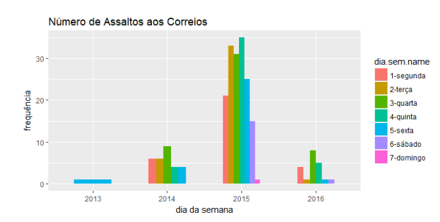


Fonte: http://periodicos.uff.br/anaisdoser/article/view/29256/16968

---
class: center, middle, inverse
#Correlograma com pacote corrplot

Preço do aluguel de imóveis e suas características


```{r eval=T, include=FALSE}
Imoveis=read.csv(file=  "https://docs.google.com/spreadsheets/d/e/2PACX-1vRbfp8QBohfVkFbIpDF6evyXSeSGtmoHL-sZYw0gE212Z9GaTgEA2ttKKhq3ynPZ-_mb7Q8Y9QLHsJX/pub?gid=1729964915&single=true&output=csv", encoding="UTF-8", stringsAsFactors = T, sep = ";")
require(corrplot)
m=as.matrix(Imoveis[,2:10])
corrplot.mixed(cor(m))
```

```{r echo=FALSE, fig.height=5, fig.width=8}
dados<- read.csv("~/Artigos_Orientacao/Luciane/Palestra_Spolm2019/Aluguel_Botafogo.csv", sep=";")
require(corrplot)
m=as.matrix(dados[,3:6])
corrplot.mixed(cor(m))
```

```{r eval=FALSE, include=FALSE, out.width="50%"}
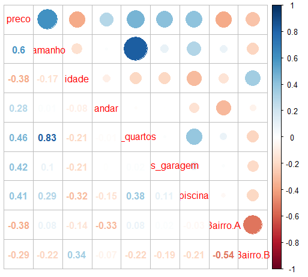
```


---
class: center, middle, inverse

#Preço do aluguel em Botafogo - Rio de Janeiro
```{r echo=FALSE, out.width="80%"}
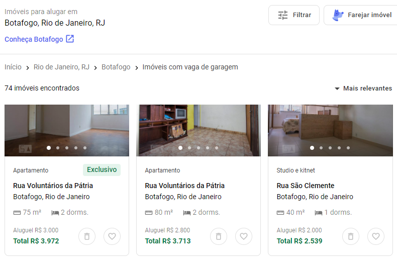
```

Fonte:(https://www.quintoandar.com.br/alugar/imovel/botafogo-rio-de-janeiro-rj-brasil). Acesso em 2/11/2019
---
#Explorando a relação entre preço e área do imóvel
```{r echo=FALSE, fig.height=6, fig.width=10}
require(ggplot2)

dados <- read.csv("~/Artigos_Orientacao/Luciane/Palestra_Spolm2019/Aluguel_Botafogo.csv", sep=";")
#Script para o gráfico de dispersão
model = lm(preco~area, dados)
n=length(dados$preco)

ggplot(dados, aes(x=area, y=preco) ) +
  geom_point() +
  geom_smooth(method = "lm") +
  labs(title = sprintf( "Regressão Linear: Preço do aluguel\nR2=%1.3f\nEquação:%1.2fX+%1.2f\nn=%1.0f",
                        summary(model)$r.squared,
                        summary(model)$coefficients[2],
                        summary(model)$coefficients[1],n[1]),
        sprintf("Equação:%1.2fX+%1.2f",summary(model)$coefficients[2], summary(model)$coefficients[1]),
       sprintf("n=%1.0f",n[1])) +
  scale_color_grey()+
  scale_fill_grey()+ 
  theme_bw() 
```

 
---
#Imóveis com até 250m2


```{r echo=FALSE, fig.height=7, fig.width=10}

require(dplyr)
dados1=dados %>% filter(area<=250)
model = lm(preco~area, dados1)
n=length(dados1$preco)

ggplot(dados1, aes(x=area, y=preco) ) +
  geom_point() +
  geom_smooth(method = "lm") +
  labs(title = sprintf( "Regressão Linear: Preço do aluguel\nR2=%1.3f\nEquação:%1.2fX+%1.2f\nn=%1.0f",
                        summary(model)$r.squared,
                        summary(model)$coefficients[2],
                        summary(model)$coefficients[1],n[1]),
        sprintf("Equação:%1.2fX+%1.2f",summary(model)$coefficients[2], summary(model)$coefficients[1]),
       sprintf("n=%1.0f",n[1])) +
  scale_color_grey()+
  scale_fill_grey()+ 
  theme_bw() 
```


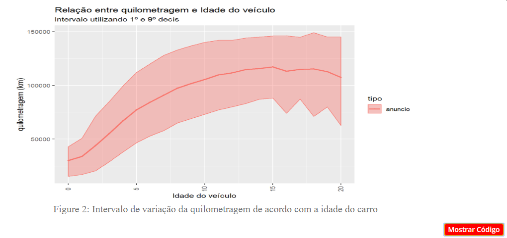

Ref(http://www.pollingdata.com.br/2019/10/como-avaliar-a-desvalorizacao-do-seu-carro/)
---
class: center, middle, inverse

#Gráfico de linhas

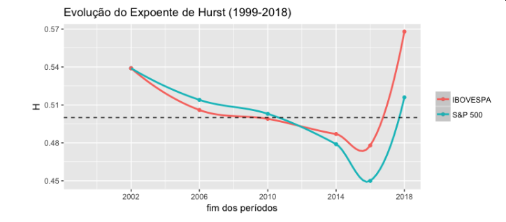

Ref: http://periodicos.uff.br/anaisdoser/article/view/29245/16959

---
class: center, middle, inverse
#Gráfico para escala de Likert


```{r echo=FALSE, out.width="80%"}
knitr::include_graphics("Figura77.png")
```

Ref: http://periodicos.uff.br/anaisdoser/issue/viewIssue/1578/158 - pag 32
---
class: center, middle, inverse
#Mapas com pacote leaflet

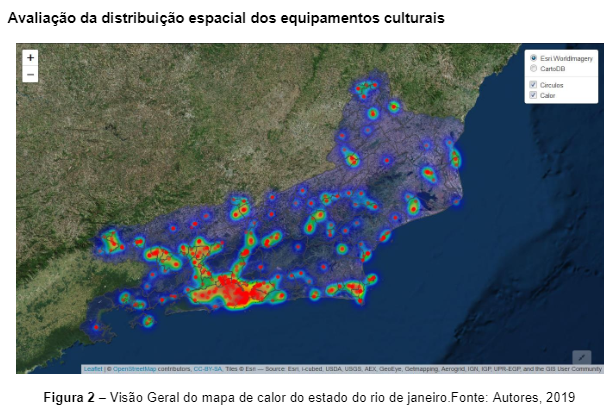

Ref: http://periodicos.uff.br/anaisdoser/article/view/29029/16862

---
#Comemorando

```{r echo=FALSE, out.width="50%"}
knitr::include_graphics("Figura55.png")
```


Ref: https://www.facebook.com/groups/1410023525939155/
---
class: center, middle
#Mapeando valores faltantes

base de dados com 6 variáveis e 20 observações. 
```{r include=FALSE}
x=c(rnorm(20,50,3), rep(NA,5))
set.seed(555)
dados=data.frame(V1=sample(x[1:21], size=20, replace=T), V2=sample(x[1:24], size=20, replace=F), V3=sample(x[1:20], size=20, replace=T), V4=sample(x[7:21], size=20, replace=T),
                 V5=sample(x[11:20], size=20, replace=T),
                 V6=sample(x[1:23], size=20, replace=T))
```


```{r echo=TRUE, fig.height=5, fig.width=8, message=FALSE, warning=FALSE}
require(DescTools)
PlotMiss(dados, main="Dados Faltantes")
```


-Qual a frequência dos dados faltantes?

-Há um padrão na distribuição dos dados faltantes?

---
class: center, middle, inverse
#O que fazer com os dados faltantes?

-Eliminar as linhas em que há dados faltantes (solução ruim)

-Utilizar um método de atribuição para dados faltantes:
###pacote "mice" ou pacote "VIM"

Os métodos de atribuição substituirão os dados faltantes por valores estimados com base nos dados completos.

###O número de casos completos deve ser pelo menos o dobro do número de variáveis a ser analisada na base de dados.
---
class: center, middle
#Identificando valores discrepantes 

*Univariado*: Utilize o boxplot,
são os pontos que aparecem fora dos traços limitadores 
```{r eval=FALSE, include=T}
boxplot(x)
```


```{r echo=FALSE, fig.height=6, fig.width=8}
x=c(rnorm(50,15,1), 10, 20)
boxplot(x)
```


##Bivariado

-Utilize Elipse 

são os pontos que caem fora da elipse que
representa o intervalo de con􀃒ança da distribuição normal bivariada.

```{r echo=FALSE}
library(ggplot2)
ggplot(faithful, aes(waiting, eruptions)) +
geom_point() +
stat_ellipse()+
  theme_bw()+
  labs(x="x", y="y")
```
---
class: center, middle
##Por que testar a normalidade dos dados?

Os testes de hipóteses paramétricos possuem como pressuposto a normalidade dos dados. O que fazer?

-Inspecionar graficamente através de um histograma 

```{r eval=FALSE, include=T}
hist(x)
```


```{r echo=FALSE, fig.height=4, fig.width=10}
set.seed(191919)
x=rnorm(50,10,1)
hist(x)
```

---
class: center, middle
# Realizar o teste de Shapiro
```{r }
shapiro.test(x)
```

###Regra de decisão

- Se p-valor < 0.05, rejeita-se a hipótese de normalidade; 
- Se p-valor $\geq$ 0.05 **aceita-se a hipótese de normalidade**

---
class: center, middle, inverse
# Comparando grupos

Na análise de dados é comum realizarmos comparações entre grupos (amostras). 

Suponha que se deseja testar se a temperatura afeta a produtividade de trabalhadores da construção civil. Cronometrou-se o tempo de execução de 3 m2 de embosso em dias com temperatura de 20, 25 e 30 graus para grupos independentes de trabalhadores


```{r echo=FALSE, out.width="100%"}

```

---
#Testando hipóteses

###O tempo médio de execução da tarefa é afetado pela variação da temperatura?

Formulação Estatística


.large[$$H_0: \mu_i=\mu_j, \forall (i,j) $$]  

.large[$$H_1: \mu_i \neq \mu_j, \exists (i,j)$$] 

Fixamos o nível de significância do teste em 0.05 (5%)

ANOVA para comparar mais de 2 amostras independentes


```{r include=FALSE}
x1=c(80, 90, 83, 92, 100 )

x2=c(90, 95, 99, 89, 81)

x3=c(114, 110, 105, 108, 99)
i=1:5

x=c(x1,x2,x3)
temp=rep(c("20", "25", "30"), each=5 )
dados=data.frame(temp, x)
knitr::kable(dados, format = "html")
```
---
class: center, middle
```{r}
boxplot(x~temp, data=dados)

```

---
class: center, middle
```{r}
#Confirmando a normalidade
shapiro.test(x)
#Testando se há diferença de rendimento ao variar a temperatura
anova(lm(x~temp, data=dados))
```

Há pelo menos uma temperatura que produz tempo médio diferente das demais temperaturas
---
#Identificando quais temperaturas produzem diferença no tempo médio
```{r}
modelo<- aov(x~temp, data=dados)
TukeyHSD(modelo)

```
---
class: center, middle, inverse
#Relatórios - Pacote Rmarkdown

```{r echo=FALSE, out.width="70%"}
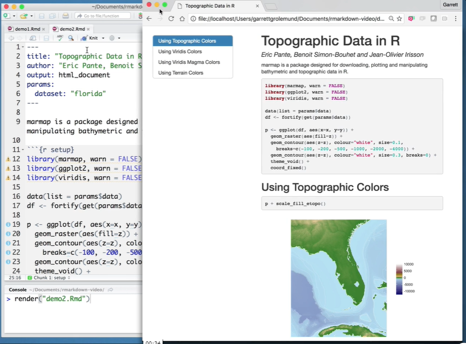
```


https://rmarkdown.rstudio.com/lesson-1.html

---
class: center, middle, inverse
#Livros para estudos


```{r echo=FALSE, out.width="80%"}
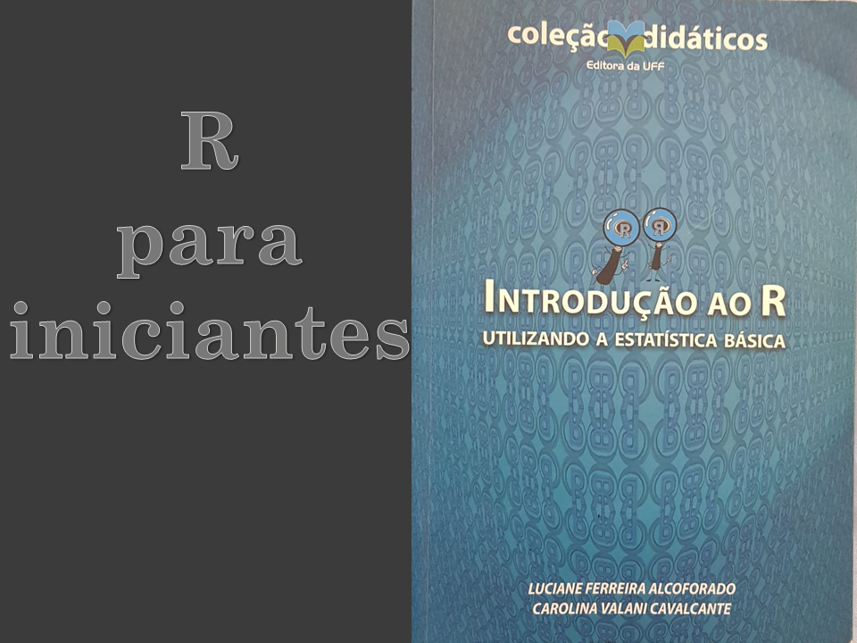
```
---
class: center, middle, inverse
#Livros para estudos
```{r echo=FALSE, out.width="80%"}
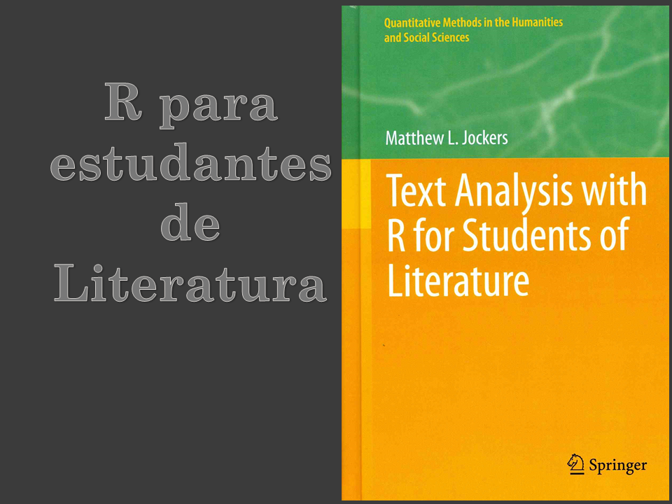
```

---
class: center, middle, inverse
#Livros para estudos
```{r echo=FALSE, out.width="80%"}

```

---
class: center, middle, inverse
#Livros para estudos
```{r echo=FALSE, out.width="80%"}
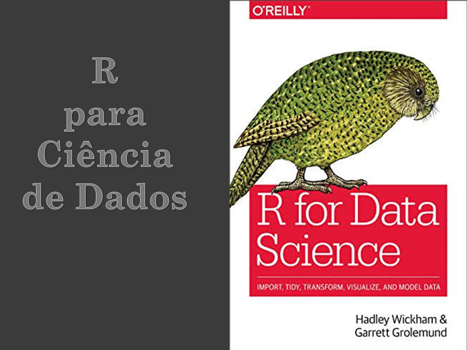
```

---
class: center, middle, inverse
#Livros para estudos
http://www.estatisticacomr.uff.br/?page_id=21
```{r echo=FALSE, out.width="50%"}
knitr::include_graphics("http://www.estatisticacomr.uff.br/wp-content/uploads/2014/12/CapaVisualizacaodados.jpg")
```

---
class: center, middle
#Projetos em desenvolvimento com R 
###Calculadora Amostral
https://lucianealcoforado.shinyapps.io/CalculadoraAmostral/
```{r echo=FALSE, out.width="80%"}
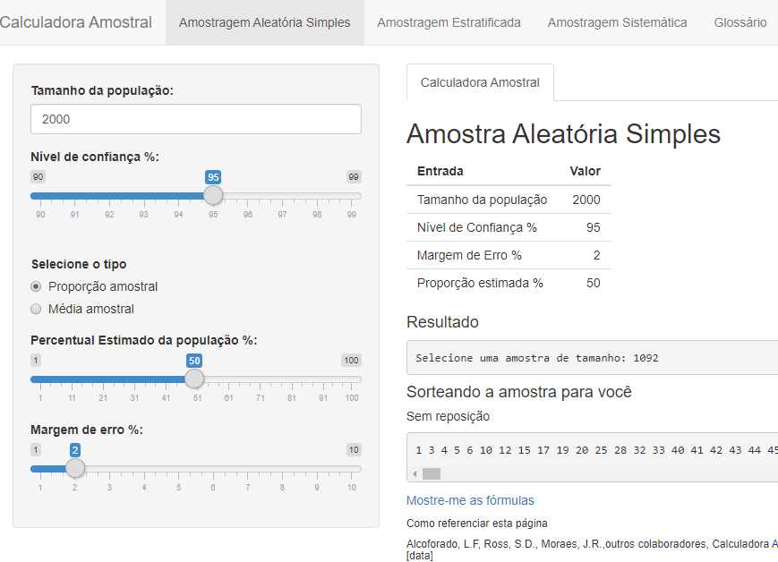
```

---
class: center, middle
#Projetos em desenvolvimento com R 
###AHP (Análise Hierárquica de Processos)
https://github.com/Lyncoln/AHP

```{r eval=FALSE, include=T}
#install.packages("devtools")
#devtools::install_github("Lyncoln/AHP2")
library(AHP)
```


```{r echo=FALSE, out.width="50%"}

```
---
class: center, middle
#Projetos em desenvolvimento com R 
###Orçamento Popular
https://duttross.shinyapps.io/orcamentopopularUFF/


```{r echo=FALSE, out.width="70%"}
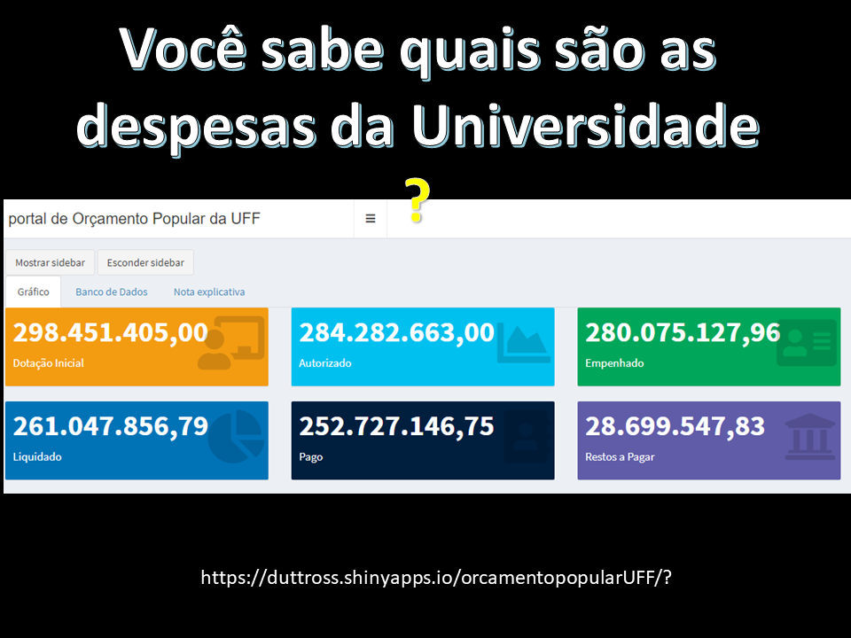
```
---
class: center, middle, inverse
#R-ladies Niterói
https://www.meetup.com/pt-BR/rladies-niteroi/

O R – Ladies Niterói é composto por 433 membros

6 mulheres organizam as palestras e minicursos voltados para a comunidade.
```{r echo=FALSE, out.width="70%"}

```

---
class: center, middle, inverse
#SER
http://ser.uff.br/

###Principal evento de R do Brasil

```{r echo=FALSE, out.width="100%"}
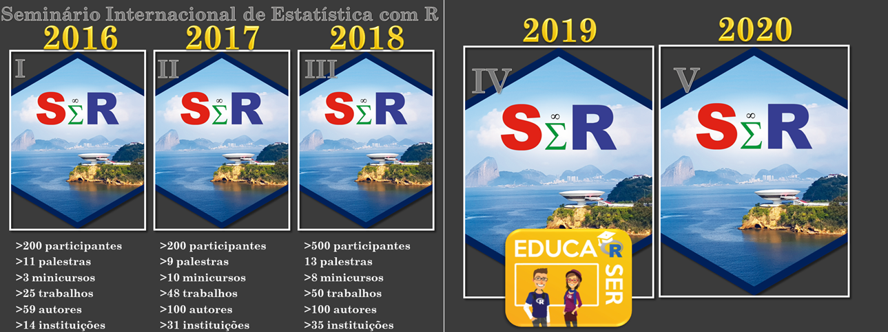
```

---
class: center, middle, inverse

# Obrigada!


Aos organizadores do Spolm 2019

Aos presentes

---
class: center, middle, inverse
#contatos

Luciane Alcoforado: lucianea@id.uff.br

Orlando Longo: orlandolongo@id.uff.br

Ariel Levy: alevy@id.uff.br

Steven Ross: steven.ross@uniriotec.br

Rede Social

https://www.facebook.com/estatisticacomr/

https://www.facebook.com/LeaRn.UFF/

https://www.facebook.com/eventoser.uff/

https://www.facebook.com/rladiesniteroi/


